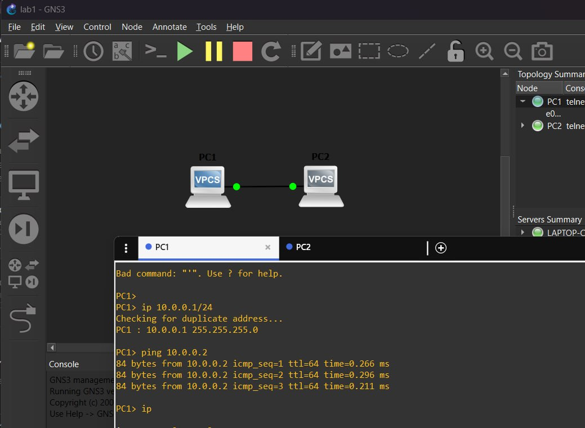
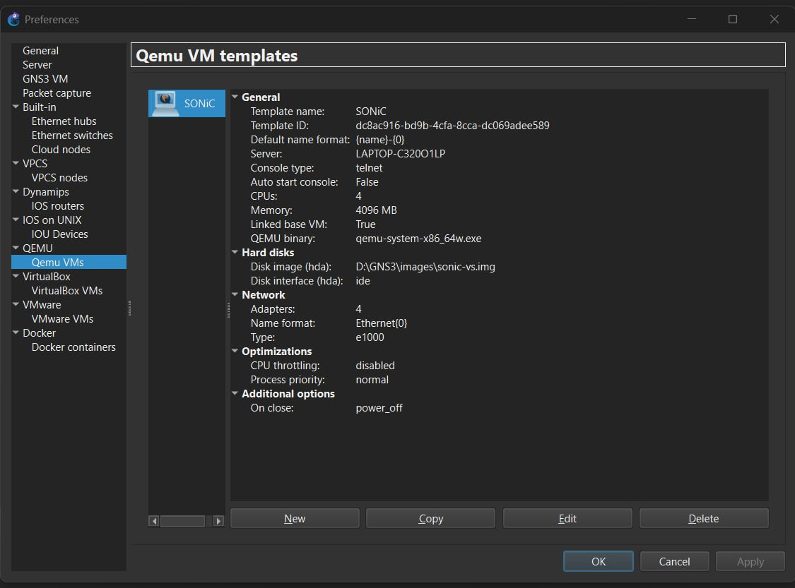
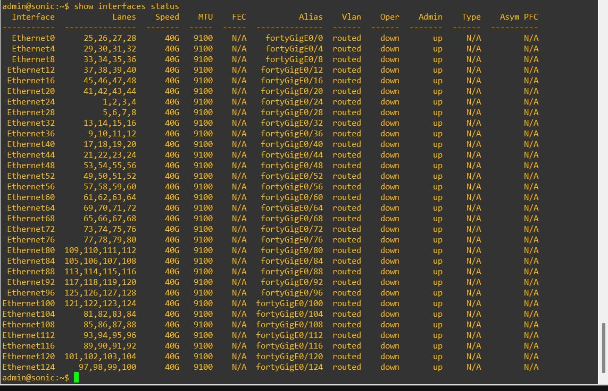
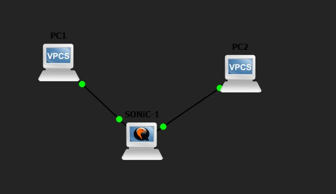
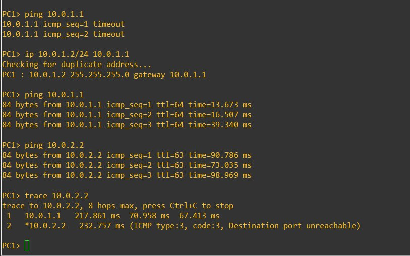

# Лабораторная работа: GNS3 + SONiC

В рамках лабораторной работы я развернул тестовый сетевой стенд в GNS3 с использованием виртуального коммутатора SONiC и двух VPCS-хостов.

Цель работы - проверить запуск SONiC в GNS3 через QEMU, настроить сетевые интерфейсы и организовать маршрутизацию между двумя отдельными подсетями.

## Используемое ПО

- Windows
- GNS3 Desktop
- QEMU
- SONiC Virtual Switch
- VPCS

В папке `images` находятся скриншоты выполнения работы, а в `report` - исходник отчёта в LaTeX.

## Установка и проверка GNS3

Сначала я установил GNS3 Desktop на Windows и создал новый пустой проект.

В качестве сервера использовался локальный GNS3 Server.

После установки я проверил запуск стандартных VPCS-узлов и убедился, что GNS3 корректно создаёт и запускает виртуальные устройства.

Также в настройках GNS3 была проверена работа QEMU, так как именно через него далее запускался SONiC.

Дополнительно была проверена доступность Dynamips.



## Добавление SONiC

Для работы использовался виртуальный образ SONiC:

```text
sonic-vs.img
```

В GNS3 я создал новый шаблон QEMU VM и указал этот образ в качестве основного виртуального диска.

Для виртуальной машины были настроены:

- процессор;
- оперативная память;
- сетевые интерфейсы;
- аппаратное ускорение QEMU.

После запуска SONiC я проверил информацию о платформе.

Пример результата:

```text
Platform: x86_64-kvm_x86_64-r0
HwSKU: Force10-S6000
ASIC: vs
```

Для проверки сетевых интерфейсов использовалась команда:

```bash
show interfaces status
```

После запуска были доступны интерфейсы вида:

```text
Ethernet0
Ethernet4
Ethernet8
...
```





## Создание тестовой топологии

В проекте GNS3 была собрана следующая схема:

```text
PC1 -------- SONiC -------- PC2
```

PC1 и PC2 находятся в разных подсетях, поэтому передача трафика между ними выполняется через SONiC.

Используемая адресация:

| Устройство | Интерфейс | IP-адрес |
|---|---|---|
| PC1 | eth0 | 10.0.1.2/24 |
| SONiC | Ethernet0 | 10.0.1.1/24 |
| SONiC | Ethernet4 | 10.0.2.1/24 |
| PC2 | eth0 | 10.0.2.2/24 |



## Настройка VPCS

На PC1 был настроен адрес:

```text
10.0.1.2/24
```

Шлюз:

```text
10.0.1.1
```

Пример команды VPCS:

```bash
ip 10.0.1.2/24 10.0.1.1
```

На PC2 был настроен адрес:

```text
10.0.2.2/24
```

Шлюз:

```text
10.0.2.1
```

Команда:

```bash
ip 10.0.2.2/24 10.0.2.1
```

## Проверка соединения

Сначала с PC1 была проверена доступность ближайшего интерфейса SONiC:

```bash
ping 10.0.1.1
```

Пример результата:

```text
84 bytes from 10.0.1.1 icmp_seq=1 ttl=64
84 bytes from 10.0.1.1 icmp_seq=2 ttl=64
84 bytes from 10.0.1.1 icmp_seq=3 ttl=64
```

После этого была проверена связность с PC2:

```bash
ping 10.0.2.2
```

Результат:

```text
84 bytes from 10.0.2.2 icmp_seq=1 ttl=63
84 bytes from 10.0.2.2 icmp_seq=2 ttl=63
84 bytes from 10.0.2.2 icmp_seq=3 ttl=63
```

Значение `ttl=63` показывает, что пакет прошёл через один промежуточный сетевой узел - SONiC.

Также маршрут был проверен командой:

```bash
trace 10.0.2.2
```

Пример:

```text
1  10.0.1.1
2  10.0.2.2
```

Первым узлом является интерфейс SONiC, после чего пакет попадает на PC2.



## Как воспроизвести стенд

Для повторения работы необходимо:

1. Установить GNS3 Desktop.
2. Проверить работу локального GNS3 Server.
3. Убедиться, что QEMU доступен в настройках GNS3.
4. Скачать совместимый образ `sonic-vs.img`.
5. Создать QEMU VM на основе образа SONiC.
6. Добавить в проект два узла VPCS.
7. Соединить PC1 с первым интерфейсом SONiC.
8. Соединить PC2 со вторым интерфейсом SONiC.
9. Настроить IP-адреса:
   - PC1 - `10.0.1.2/24`;
   - SONiC Ethernet0 - `10.0.1.1/24`;
   - SONiC Ethernet4 - `10.0.2.1/24`;
   - PC2 - `10.0.2.2/24`.
10. На PC1 указать шлюз `10.0.1.1`.
11. На PC2 указать шлюз `10.0.2.1`.
12. Проверить связь через `ping`.
13. Проверить маршрут через `trace`.

## Результат

В результате был собран рабочий виртуальный стенд на базе GNS3 и SONiC.

SONiC успешно запустился в QEMU, сетевые интерфейсы были доступны, а два VPCS-хоста смогли обмениваться трафиком через виртуальный коммутатор.

Проверка с помощью `ping` и `trace` показала, что маршрутизация между подсетями `10.0.1.0/24` и `10.0.2.0/24` работает корректно.
