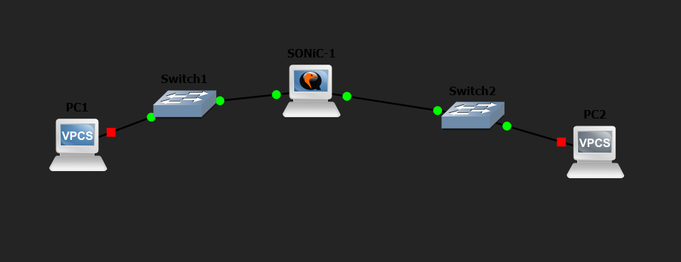
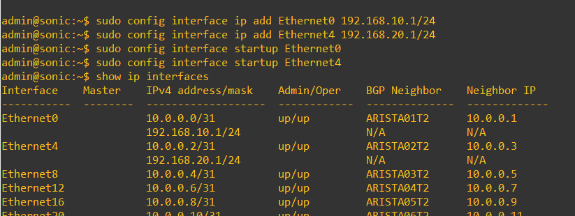
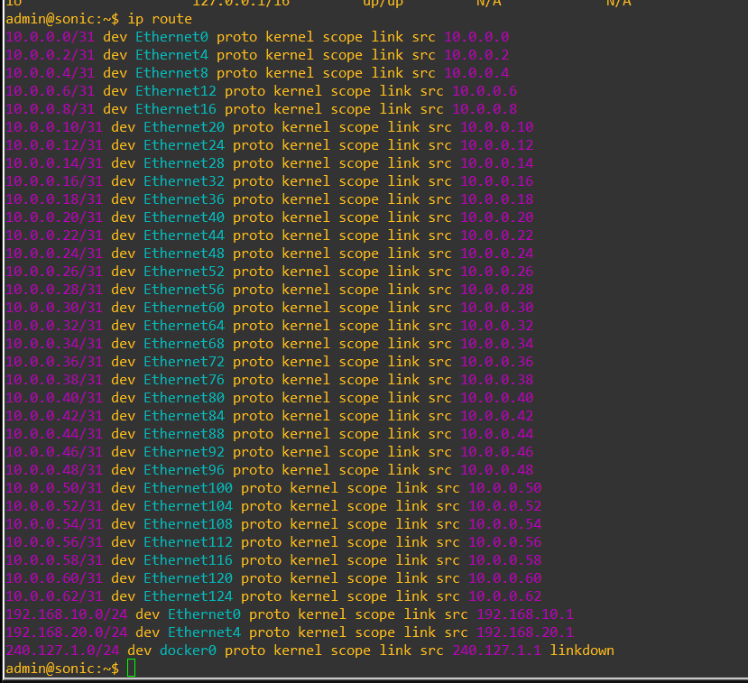
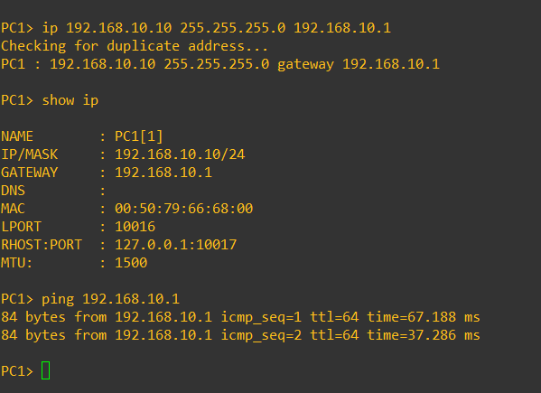
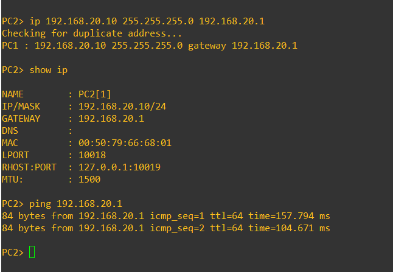
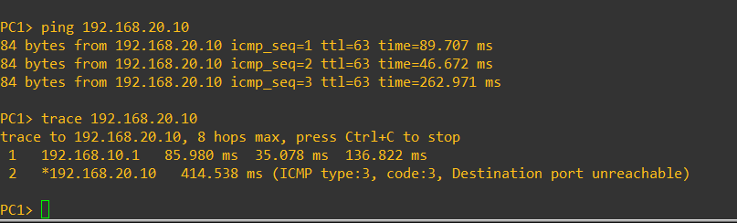
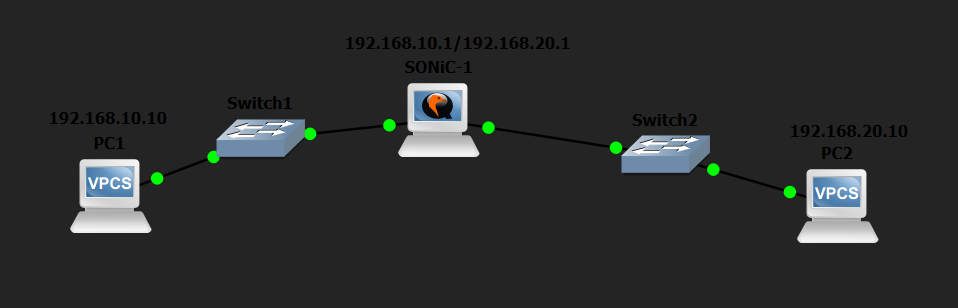

# Лабораторная работа №2: маршрутизация в SONiC

В этой лабораторной работе я собрал сеть в GNS3 с использованием маршрутизатора SONiC, двух встроенных Ethernet switch и двух VPCS-хостов.

В отличие от первой работы, здесь основной задачей была уже не просто проверка запуска SONiC, а настройка маршрутизации между двумя отдельными подсетями и проверка передачи трафика между ними.

## Цель работы

Настроить маршрутизацию между двумя сетевыми сегментами через SONiC и проверить, что два хоста из разных подсетей могут обмениваться трафиком.

Для этого требовалось:

- создать топологию в GNS3;
- настроить IP-адреса на интерфейсах SONiC;
- настроить IP-адреса и шлюзы на PC1 и PC2;
- проверить таблицу маршрутизации;
- проверить доступность шлюзов;
- выполнить ping между PC1 и PC2;
- проверить маршрут с помощью `trace`.

## Создание топологии

В GNS3 был создан новый проект, в который были добавлены:

- один узел SONiC;
- два встроенных Ethernet switch;
- два VPCS-хоста.

Получилась следующая схема:

```text
PC1 --- Switch1 --- SONiC --- Switch2 --- PC2
```

Каждый хост был подключен к своему коммутатору, а коммутаторы были подключены к разным интерфейсам SONiC.

Для соединения с пользовательскими сегментами использовались первые два data-plane интерфейса SONiC. Management-интерфейс в этой схеме не использовался.



## План адресации

Для двух частей сети использовались разные подсети `/24`.

| Устройство | Интерфейс | IP-адрес | Шлюз |
|---|---|---|---|
| PC1 | e0 | 192.168.10.10/24 | 192.168.10.1 |
| SONiC | Ethernet0 | 192.168.10.1/24 | - |
| SONiC | Ethernet4 | 192.168.20.1/24 | - |
| PC2 | e0 | 192.168.20.10/24 | 192.168.20.1 |

Таким образом, сеть `192.168.10.0/24` использовалась для первого сегмента, а `192.168.20.0/24` - для второго.

## Настройка интерфейсов SONiC

После загрузки SONiC были настроены IP-адреса на двух интерфейсах.

Для первого сегмента использовался `Ethernet0`:

```bash
sudo config interface ip add Ethernet0 192.168.10.1/24
```

Для второго сегмента использовался `Ethernet4`:

```bash
sudo config interface ip add Ethernet4 192.168.20.1/24
```

После этого интерфейсы были включены:

```bash
sudo config interface startup Ethernet0
sudo config interface startup Ethernet4
```

Для проверки использовалась команда:

```bash
show ip interfaces
```

После настройки было видно, что `Ethernet0` и `Ethernet4` находятся в состоянии `up/up` и имеют адреса:

```text
Ethernet0  192.168.10.1/24
Ethernet4  192.168.20.1/24
```

В виртуальном образе SONiC на этих интерфейсах уже присутствовали служебные адреса `/31`. Их я не удалял, а адреса для лабораторной добавил дополнительно.



## Проверка таблицы маршрутизации

После назначения IP-адресов была проверена таблица маршрутизации SONiC:

```bash
ip route
```

В таблице появились маршруты к двум сетям:

```text
192.168.10.0/24
192.168.20.0/24
```

Первая сеть была доступна через `Ethernet0`, вторая - через `Ethernet4`.

Так как обе сети напрямую подключены к SONiC, отдельные статические маршруты между ними добавлять не потребовалось.



## Настройка PC1

На первом VPCS был задан адрес `192.168.10.10/24` и шлюз `192.168.10.1`.

Команда настройки:

```bash
ip 192.168.10.10 255.255.255.0 192.168.10.1
```

После этого параметры были проверены:

```bash
show ip
```

Затем была проверена доступность интерфейса SONiC:

```bash
ping 192.168.10.1
```

Ping до шлюза прошёл успешно.



## Настройка PC2

На втором VPCS был задан адрес `192.168.20.10/24` и шлюз `192.168.20.1`.

Команда:

```bash
ip 192.168.20.10 255.255.255.0 192.168.20.1
```

Проверка параметров:

```bash
show ip
```

Проверка доступности шлюза:

```bash
ping 192.168.20.1
```

Интерфейс SONiC со стороны второго сегмента также отвечал на ICMP-запросы.



## Проверка связи между PC1 и PC2

После настройки обоих сегментов была выполнена основная проверка - ping с PC1 на PC2.

```bash
ping 192.168.20.10
```

PC2 успешно ответил на ICMP-запросы.

В ответах было значение `ttl=63`. Это показывает, что пакет прошёл через один промежуточный маршрутизатор - SONiC.

После этого маршрут был проверен командой:

```bash
trace 192.168.20.10
```

Трассировка показала два шага:

```text
1  192.168.10.1
2  192.168.20.10
```

Первым узлом был шлюз PC1 на SONiC, вторым - PC2.

В конце `trace` появлялось сообщение:

```text
Destination port unreachable
```

В данном случае это был ответ конечного VPCS, а не ошибка маршрутизации.



## Итоговая топология

После завершения настройки все устройства были запущены, а на схеме GNS3 были подписаны адреса конечных хостов и интерфейсов маршрутизатора.



## Как воспроизвести работу

1. Создать новый проект в GNS3.
2. Добавить SONiC.
3. Добавить два встроенных Ethernet switch.
4. Добавить два VPCS.
5. Собрать схему:

```text
PC1 --- Switch1 --- SONiC --- Switch2 --- PC2
```

6. Подключить первый сегмент к `Ethernet0`, второй к `Ethernet4`.
7. Настроить интерфейсы SONiC:

```bash
sudo config interface ip add Ethernet0 192.168.10.1/24
sudo config interface ip add Ethernet4 192.168.20.1/24
sudo config interface startup Ethernet0
sudo config interface startup Ethernet4
```

8. Проверить состояние интерфейсов:

```bash
show ip interfaces
```

9. Проверить таблицу маршрутизации:

```bash
ip route
```

10. Настроить PC1:

```bash
ip 192.168.10.10 255.255.255.0 192.168.10.1
```

11. Настроить PC2:

```bash
ip 192.168.20.10 255.255.255.0 192.168.20.1
```

12. Проверить доступность шлюзов:

```bash
ping 192.168.10.1
ping 192.168.20.1
```

13. Проверить связь между хостами:

```bash
ping 192.168.20.10
```

14. Проверить маршрут:

```bash
trace 192.168.20.10
```

## Результат

В результате была собрана сеть из SONiC, двух коммутаторов и двух VPCS-хостов.

На интерфейсах SONiC были настроены адреса из двух разных подсетей, после чего в таблице маршрутизации появились напрямую подключенные сети `192.168.10.0/24` и `192.168.20.0/24`.

PC1 и PC2 успешно получили доступ к своим шлюзам, а затем смогли обмениваться трафиком между разными подсетями через SONiC.

Проверки `ping` и `trace` подтвердили, что маршрутизация между двумя сегментами работает корректно.
