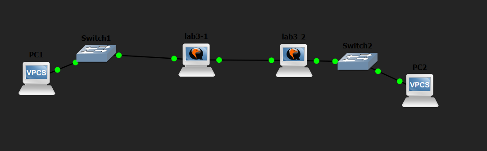
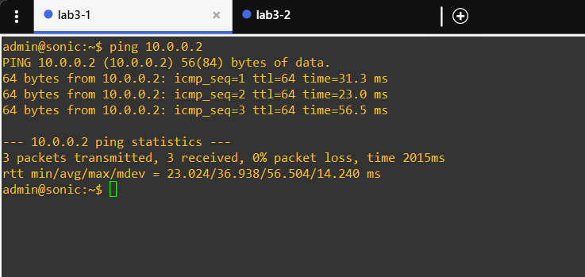
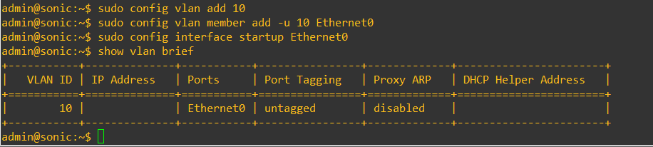
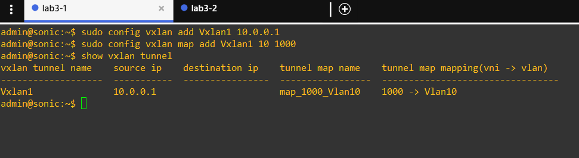
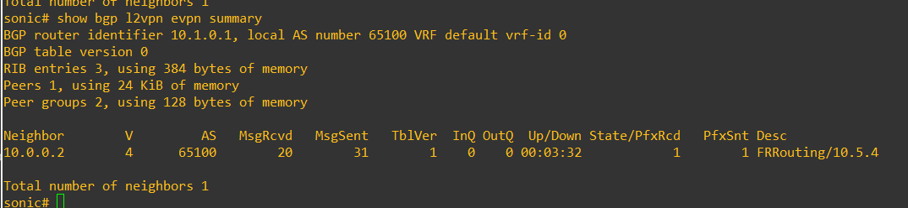
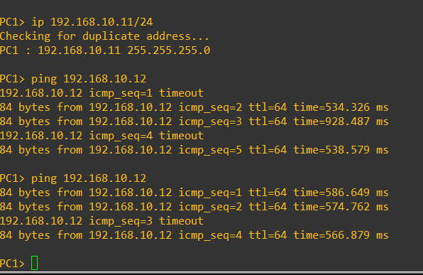
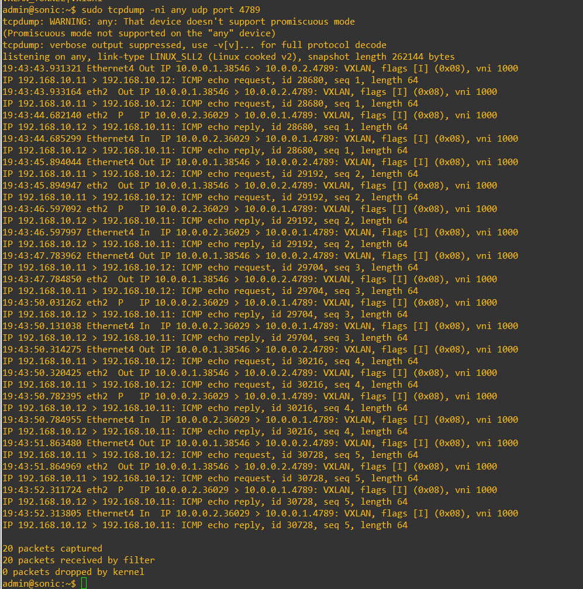

# Лабораторная работа №3: VXLAN в SONiC

В этой лабораторной работе я собрал оверлейную сеть VXLAN в GNS3 на базе двух маршрутизаторов SONiC.

Сначала между маршрутизаторами была настроена обычная IP-связность - underlay-сеть. После этого поверх нее был создан VXLAN-туннель, благодаря которому два хоста из разных физических сегментов GNS3 оказались в одной логической L2-сети VLAN 10.

## Цель работы

Разобраться с базовой настройкой VXLAN в SONiC и проверить передачу L2-трафика между двумя удаленными сегментами через IP-сеть.

Для выполнения работы требовалось:

- собрать топологию из двух SONiC, двух коммутаторов и двух VPCS;
- настроить underlay между R1 и R2;
- создать VLAN 10;
- сопоставить VLAN 10 с VNI 1000;
- настроить VTEP на обоих маршрутизаторах;
- настроить BGP EVPN между R1 и R2;e
- проверить ping между PC1 и PC2;
- убедиться, что трафик действительно передается в VXLAN-инкапсуляции.

## Создание топологии

В GNS3 был создан новый проект. В него были добавлены:

- два узла SONiC;
- два встроенных Ethernet switch;
- два VPCS-хоста.

Получилась следующая схема:

```text
PC1 --- Switch1 --- R1 --- R2 --- Switch2 --- PC2
```

Между R1 и R2 была организована отдельная связь для underlay-сети.

В используемом образе SONiC management-интерфейс QEMU соответствует `eth0`, поэтому для пользовательского трафика использовались data-plane интерфейсы:

```text
eth1 в GNS3 -> Ethernet0 в SONiC
eth2 в GNS3 -> Ethernet4 в SONiC
```

`Ethernet0` использовался для подключения локального сегмента, а `Ethernet4` - для связи между R1 и R2.



## План адресации

Для underlay использовалась сеть:

```text
10.0.0.0/24
```

Для overlay-хостов использовалась сеть:

```text
192.168.10.0/24
```

| Узел | Интерфейс | Адрес | Назначение |
|---|---|---|---|
| PC1 | e0 | 192.168.10.11/24 | Overlay-хост |
| R1 | Ethernet0 | без IP | VLAN 10, access |
| R1 | Ethernet4 | 10.0.0.1/24 | Underlay |
| R2 | Ethernet4 | 10.0.0.2/24 | Underlay |
| R2 | Ethernet0 | без IP | VLAN 10, access |
| PC2 | e0 | 192.168.10.12/24 | Overlay-хост |

## Настройка underlay

В исходном образе SONiC на интерфейсах уже были тестовые адреса `/31`, поэтому на используемых портах они были предварительно удалены.

На R1:

```bash
sudo config interface ip remove Ethernet0 10.0.0.0/31
sudo config interface ip remove Ethernet4 10.0.0.2/31
sudo config interface ip add Ethernet4 10.0.0.1/24
sudo config interface startup Ethernet4
```

На R2:

```bash
sudo config interface ip remove Ethernet0 10.0.0.0/31
sudo config interface ip remove Ethernet4 10.0.0.2/31
sudo config interface ip add Ethernet4 10.0.0.2/24
sudo config interface startup Ethernet4
```

После настройки была проверена IP-связность между R1 и R2.

С R1:

```bash
ping 10.0.0.2
ip route
```

Ping прошел без потерь. Так как оба underlay-адреса находятся в одной подсети, дополнительный статический маршрут между маршрутизаторами не потребовался.



## Настройка VLAN 10

Оба конечных хоста должны были находиться в одной логической L2-сети, поэтому на R1 и R2 была создана VLAN 10.

Интерфейс `Ethernet0`, подключенный к локальному коммутатору, был добавлен в VLAN как untagged-порт.

На обоих SONiC выполнялись одинаковые команды:

```bash
sudo config vlan add 10
sudo config vlan member add -u 10 Ethernet0
sudo config interface startup Ethernet0
show vlan brief
```

После настройки `Ethernet0` отображался как untagged-член VLAN 10.

IP-адрес на `Ethernet0` не назначался, так как в этой лабораторной он использовался как L2-порт.



## Создание VXLAN и сопоставление VLAN с VNI

После настройки underlay и VLAN на обоих маршрутизаторах были созданы VTEP с именем `Vxlan1`.

В качестве source IP использовались underlay-адреса:

```text
R1 -> 10.0.0.1
R2 -> 10.0.0.2
```

VLAN 10 была сопоставлена с:

```text
VNI 1000
```

Конфигурация R1:

```bash
sudo config vxlan add Vxlan1 10.0.0.1
sudo config vxlan evpn_nvo add nvo1 Vxlan1
sudo config vxlan map add Vxlan1 10 1000
```

Конфигурация R2:

```bash
sudo config vxlan add Vxlan1 10.0.0.2
sudo config vxlan evpn_nvo add nvo1 Vxlan1
sudo config vxlan map add Vxlan1 10 1000
```

Для проверки использовались команды:

```bash
show vxlan tunnel
sudo sonic-db-cli CONFIG_DB KEYS "VXLAN*"
```

На R1 отображался туннель `Vxlan1` с source IP `10.0.0.1` и mapping:

```text
VNI 1000 -> Vlan10
```

На R2 была создана аналогичная конфигурация с source IP `10.0.0.2`.



## Настройка BGP EVPN

В используемой версии SONiC отдельной команды для статического VXLAN peer не было, поэтому обмен информацией между VTEP был настроен через BGP EVPN.

Оба экземпляра SONiC изначально имели тестовую BGP-конфигурацию. Для лабораторной был оставлен AS:

```text
65100
```

На R1 была настроена EVPN-сессия с R2:

```bash
docker exec -it bgp vtysh
configure terminal
router bgp 65100
no neighbor 10.0.0.1
neighbor 10.0.0.2 remote-as 65100
address-family l2vpn evpn
neighbor 10.0.0.2 activate
advertise-all-vni
exit-address-family
end
```

На R2 был установлен отдельный `router-id`:

```text
10.1.0.2
```

Это потребовалось, потому что оба экземпляра SONiC были созданы из одного виртуального образа и изначально имели одинаковый router-id.

Конфигурация R2:

```bash
configure terminal
router bgp 65100
bgp router-id 10.1.0.2
no neighbor 10.0.0.1
neighbor 10.0.0.1 remote-as 65100
address-family l2vpn evpn
neighbor 10.0.0.1 activate
advertise-all-vni
exit-address-family
end
```

Состояние BGP EVPN проверялось командой:

```bash
docker exec bgp vtysh -c "show bgp l2vpn evpn summary"
```

После установления сессии в столбце `State/PfxRcd` отображалось значение `1`, то есть соседство было установлено и EVPN-маршрут был получен.



## Настройка хостов

Для проверки L2-overlay оба VPCS были помещены в одну IP-подсеть:

```text
192.168.10.0/24
```

Шлюз не задавался, так как хосты должны были общаться напрямую на втором уровне через VXLAN.

На PC1:

```bash
ip 192.168.10.11/24
```

На PC2:

```bash
ip 192.168.10.12/24
```

После настройки с PC1 был выполнен ping до PC2:

```bash
ping 192.168.10.12
```

Ответы от PC2 были получены.

При этом TTL оставался равным `64`, потому что для конечных хостов это одна L2-сеть и обычная IP-маршрутизация между ними не выполняется.



## Проверка VXLAN-инкапсуляции

Одного успешного ping недостаточно, чтобы показать именно работу VXLAN, поэтому дополнительно был выполнен захват трафика на стандартном VXLAN UDP-порту `4789`.

На SONiC была запущена команда:

```bash
sudo tcpdump -ni any udp port 4789
```

Во время захвата с PC1 выполнялся ping до PC2:

```bash
ping 192.168.10.12
```

В `tcpdump` были видны внешние пакеты между VTEP:

```text
10.0.0.1 <-> 10.0.0.2
```

Пакеты имели отметку VXLAN и:

```text
VNI 1000
```

Внутри инкапсулированного трафика отображались ICMP echo request от:

```text
192.168.10.11 -> 192.168.10.12
```

и обратные ICMP echo reply.

Таким образом было подтверждено, что L2-трафик VLAN 10 действительно инкапсулируется в VXLAN и передается через underlay-сеть.



## Как воспроизвести работу

1. Создать новый проект в GNS3.
2. Добавить два узла SONiC.
3. Добавить два Ethernet switch.
4. Добавить два VPCS.
5. Собрать схему:

```text
PC1 --- Switch1 --- R1 --- R2 --- Switch2 --- PC2
```

6. Подключить локальные сегменты через `Ethernet0`.
7. Соединить R1 и R2 через `Ethernet4`.
8. Удалить тестовые `/31`-адреса с используемых интерфейсов.
9. Настроить underlay:

```text
R1 Ethernet4 -> 10.0.0.1/24
R2 Ethernet4 -> 10.0.0.2/24
```

10. Проверить связь:

```bash
ping 10.0.0.2
```

11. На обоих SONiC создать VLAN 10 и добавить `Ethernet0` как untagged-порт.
12. Создать `Vxlan1`.
13. Настроить mapping:

```text
VLAN 10 -> VNI 1000
```

14. Настроить BGP EVPN между `10.0.0.1` и `10.0.0.2`.
15. Проверить BGP EVPN:

```bash
docker exec bgp vtysh -c "show bgp l2vpn evpn summary"
```

16. Настроить хосты:

```text
PC1 -> 192.168.10.11/24
PC2 -> 192.168.10.12/24
```

17. Проверить связь:

```bash
ping 192.168.10.12
```

18. Запустить захват VXLAN-трафика:

```bash
sudo tcpdump -ni any udp port 4789
```

19. Убедиться, что пакеты передаются между `10.0.0.1` и `10.0.0.2` с VNI 1000.

## Результат

В результате была собрана сеть из двух маршрутизаторов SONiC, двух коммутаторов и двух VPCS-хостов.

Между R1 и R2 была настроена underlay-сеть `10.0.0.0/24`, после чего на обоих маршрутизаторах были созданы VLAN 10, VTEP `Vxlan1` и сопоставление:

```text
VLAN 10 -> VNI 1000
```

Для обмена информацией между VTEP была настроена BGP EVPN-сессия.

Хосты `192.168.10.11` и `192.168.10.12`, находящиеся в разных физических сегментах GNS3, смогли обмениваться ICMP-пакетами как узлы одной L2-сети.

Захват `tcpdump` показал VXLAN-пакеты между `10.0.0.1` и `10.0.0.2` на UDP-порту `4789` с VNI 1000, поэтому работа VXLAN была подтверждена на практике.
